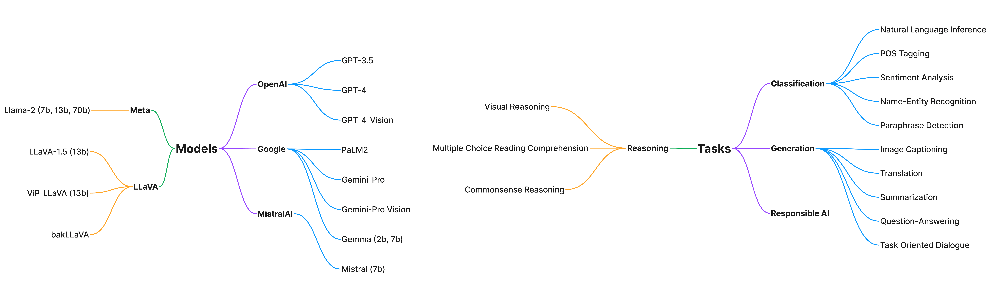

<h2 align="center">
  Official Code for MEGAVERSE
</h2>

<p align="center">
  <a href="https://aclanthology.org/2024.naacl-long.143/"></a>
  <a href="https://github.com/microsoft/MEGAVERSE/blob/main/LICENSE">
    
  </a>
</p>


# Introduction 
This codebase builds on the codebase of MEGA from [here](https://github.com/microsoft/Multilingual-Evaluation-of-Generative-AI-MEGA). MEGAVERSE covers new datasets (AfriQA, Belebele, X-RiSAWOZ, IN-22), and multimodal datasets (MarVL, XM-3600) along with new open-source models (Gemma, llama2, and Mistral).



# Getting Started

### Dependencies
- Compatible with Python3.8
- The necessary packages can be install through requirements.txt.

### Setup

We recommend creating a virtual environment for the framework (optional):

```shell
$ [sudo] pip install virtualenv
$ virtualenv -p python3.8 megaenv
$ source megaenv/bin/activate
```

Install the required packages by running:


```shell
pip install -r requirements.txt
```

The framework requires keys and endpoints for [OpenAI API](https://platform.openai.com), and [HuggingFace API](https://huggingface.co/inference-api) for inferencing. Please place all the keys, endpoints and expected env variables under `envs/melange.env`

#### Expected env variables
1. `OPENAI_END_POINT`
2. `OPENAI_API_KEY`
3. `OPENAI_API_TYPE`
4. `OPENAI_API_VERSION`
5. `HF_API_URL`
6. `HF_API_KEY`

# Running Evaluation

## XNLI

The following language prompts are currently available in the framework

Language | Available Prompts
-------- | -----------------
en (English) | GPT-3 Style, MNLI crowdsource, always/sometimes/never, based on the previous passage,...
hi (Hindi) | English GPT-3 Style, Handcrafted GPT-3 Style, English based on the previous passage, Handcrafted based on the previous passage, ...

The full list can be found in `promptsource`. Check [`promptsource/README.md`](promptsource/README.md) for details.

To run the evaluation on XNLI, execute the following command
```shell
$ python -m mega.eval_xnli \
    -t {Target Language} \
    -p {Pivot Language} \
    -k {Number of Few-shot Examples} \
    --tgt_prompt_name {Prompt Name For Target} \ 
    --pivot_prompt_name {Prompt Name For Pivot} \
    --model {GPT Model to Evaluate} \
    {--translate-test}
```

An example command would look like:

```shell
python -m mega.eval_xnli \
    -p hi \
    -t hi \
    -k 8 \
    --pivot_prompt_name "Handcrafted based on the previous passage" \
    --tgt_prompt_name "Handcrafted based on the previous passage" \
    --model gpt-35-turbo
```

We also have shell scripts for all the datasets. The scripts reside in `scripts` for API based querying and `hf_scripts` for local model querying respectively.
To run multimodal benchmarks, refer to the README in `multimodal/README.md`


For contamination analysis, refer to the README in `contamination/README.md` file to run analysis for closed source models such as GPT-4 and PaLM2. For open-source contamination analysis, we referred to the work by Oren et. al [here](https://github.com/tatsu-lab/test_set_contamination).


## Citation

If you're using this code, then please cite both MEGA and MEGAVERSE using the following citations.

```
@inproceedings{ahuja-etal-2024-megaverse,
    title = "{MEGAVERSE}: Benchmarking Large Language Models Across Languages, Modalities, Models and Tasks",
    author = "Ahuja, Sanchit  and
      Aggarwal, Divyanshu  and
      Gumma, Varun  and
      Watts, Ishaan  and
      Sathe, Ashutosh  and
      Ochieng, Millicent  and
      Hada, Rishav  and
      Jain, Prachi  and
      Ahmed, Mohamed  and
      Bali, Kalika  and
      Sitaram, Sunayana",
    editor = "Duh, Kevin  and
      Gomez, Helena  and
      Bethard, Steven",
    booktitle = "Proceedings of the 2024 Conference of the North American Chapter of the Association for Computational Linguistics: Human Language Technologies (Volume 1: Long Papers)",
    month = jun,
    year = "2024",
    address = "Mexico City, Mexico",
    publisher = "Association for Computational Linguistics",
    url = "https://aclanthology.org/2024.naacl-long.143",
    pages = "2598--2637",
    abstract = "There has been a surge in LLM evaluation research to understand LLM capabilities and limitations. However, much of this research has been confined to English, leaving LLM building and evaluation for non-English languages relatively unexplored. Several new LLMs have been introduced recently, necessitating their evaluation on non-English languages. This study aims to perform a thorough evaluation of the non-English capabilities of SoTA LLMs (GPT-3.5-Turbo, GPT-4, PaLM2, Gemini-Pro, Mistral, Llama2, and Gemma) by comparing them on the same set of multilingual datasets. Our benchmark comprises 22 datasets covering 83 languages, including low-resource African languages. We also include two multimodal datasets in the benchmark and compare the performance of LLaVA models, GPT-4-Vision and Gemini-Pro-Vision. Our experiments show that larger models such as GPT-4, Gemini-Pro and PaLM2 outperform smaller models on various tasks, notably on low-resource languages, with GPT-4 outperforming PaLM2 and Gemini-Pro on more datasets. We also perform a study on data contamination and find that several models are likely to be contaminated with multilingual evaluation benchmarks, necessitating approaches to detect and handle contamination while assessing the multilingual performance of LLMs.",
}
```

```
@inproceedings{ahuja-etal-2023-mega,
    title = "{MEGA}: Multilingual Evaluation of Generative {AI}",
    author = "Ahuja, Kabir  and
      Diddee, Harshita  and
      Hada, Rishav  and
      Ochieng, Millicent  and
      Ramesh, Krithika  and
      Jain, Prachi  and
      Nambi, Akshay  and
      Ganu, Tanuja  and
      Segal, Sameer  and
      Ahmed, Mohamed  and
      Bali, Kalika  and
      Sitaram, Sunayana",
    editor = "Bouamor, Houda  and
      Pino, Juan  and
      Bali, Kalika",
    booktitle = "Proceedings of the 2023 Conference on Empirical Methods in Natural Language Processing",
    month = dec,
    year = "2023",
    address = "Singapore",
    publisher = "Association for Computational Linguistics",
    url = "https://aclanthology.org/2023.emnlp-main.258",
    doi = "10.18653/v1/2023.emnlp-main.258",
    pages = "4232--4267",
    abstract = "Generative AI models have shown impressive performance on many Natural Language Processing tasks such as language understanding, reasoning, and language generation. An important question being asked by the AI community today is about the capabilities and limits of these models, and it is clear that evaluating generative AI is very challenging. Most studies on generative LLMs have been restricted to English and it is unclear how capable these models are at understanding and generating text in other languages. We present the first comprehensive benchmarking of generative LLMs - MEGA, which evaluates models on standard NLP benchmarks, covering 16 NLP datasets across 70 typologically diverse languages. We compare the performance of generative LLMs including Chat-GPT and GPT-4 to State of the Art (SOTA) non-autoregressive models on these tasks to determine how well generative models perform compared to the previous generation of LLMs. We present a thorough analysis of the performance of models across languages and tasks and discuss challenges in improving the performance of generative LLMs on low-resource languages. We create a framework for evaluating generative LLMs in the multilingual setting and provide directions for future progress in the field.",
}
```


## Contributing

This project welcomes contributions and suggestions.  Most contributions require you to agree to a
Contributor License Agreement (CLA) declaring that you have the right to, and actually do, grant us
the rights to use your contribution. For details, visit https://cla.opensource.microsoft.com.

When you submit a pull request, a CLA bot will automatically determine whether you need to provide
a CLA and decorate the PR appropriately (e.g., status check, comment). Simply follow the instructions
provided by the bot. You will only need to do this once across all repos using our CLA.

This project has adopted the [Microsoft Open Source Code of Conduct](https://opensource.microsoft.com/codeofconduct/).
For more information see the [Code of Conduct FAQ](https://opensource.microsoft.com/codeofconduct/faq/) or
contact [opencode@microsoft.com](mailto:opencode@microsoft.com) with any additional questions or comments.

## Trademarks

This project may contain trademarks or logos for projects, products, or services. Authorized use of Microsoft 
trademarks or logos is subject to and must follow 
[Microsoft's Trademark & Brand Guidelines](https://www.microsoft.com/en-us/legal/intellectualproperty/trademarks/usage/general).
Use of Microsoft trademarks or logos in modified versions of this project must not cause confusion or imply Microsoft sponsorship.
Any use of third-party trademarks or logos are subject to those third-party's policies.


## Privacy

You can read more about Microsoft's privacy statement [here](https://privacy.microsoft.com/en-us/privacystatement).
